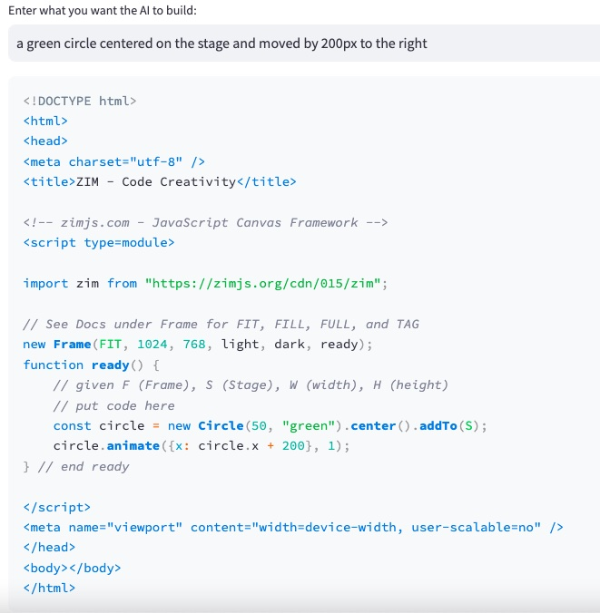
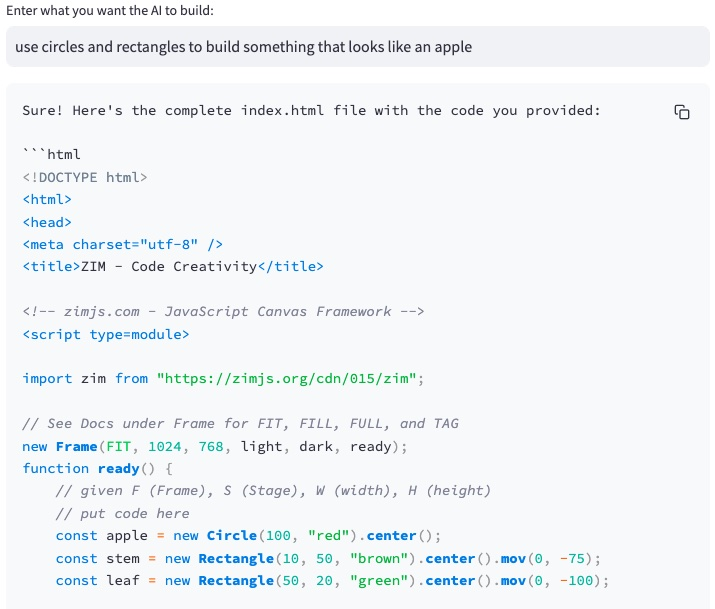
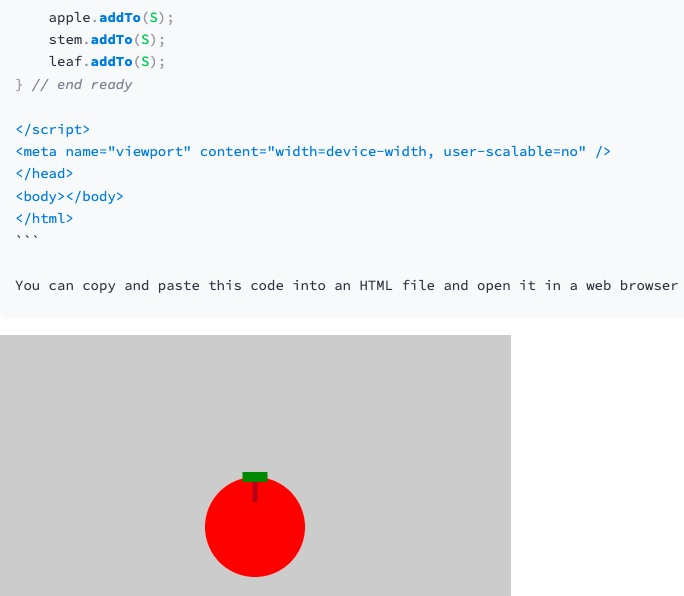

# langchain-zim-generator

This python script uses langchain and OpenAI to create an index.html file containing ZIM code.
It takes the whole zimdocs.txt file (thanks to Dr. Abstract - https://zimjs.com/docs.html), splits it into smaller pieces that are embedded in a vectorsore. The query is placed in the same vectorstore and returns similar chunks from the documentation, from which a ZIM code is generated using some very clever 😉 prompt engineering.

This version uses an in-memory vectorstore (FAISS) and recreates the embeddings every time it runs.

Here is a version where the vectorstore is already created and hosted at pinecone:

https://github.com/ajerni/langchain-zim-generator-pinecone

Please note that the use of OpenAI embeddings seems to work with OpenAI Keys from payed plans only.

## Examples

## Demo

Try it live here:

In-Memory Version: https://zim-generator-dev.streamlit.app/
Hosted Version: https://zim-generator.streamlit.app/

## How to install for local development:

1. Install Python 3.10 on your machine and use a bash terminal (maybe within Visual Studio Code)
2. Git Clone: `git clone https://github.com/ajerni/langchain-zim-generator.git`
3. Move to the new directory: `cd langchain-zim-generator`
4. Create Virtual Environment: `python -m venv env` or `python3 -m venv env` (on Windows: `python -m venv c:\path\to\env`)
5. Activate Virtual Environment: `source env/bin/activate` on Mac or `env\Scripts\activate` on Windows
6. Install Dependencies: `pip install -r requirements.txt`
7. Create a .env file containing your OpenAI Key: `echo "OPENAI_API_KEY=xyz" > .env` (replace xyz with your own OpenAI Key) - or just enter your API Key when running the app (.env is only used for local development)
8. Run the app: `streamlit run main.py`
9. Fork my repo and start developing until we have the ultimate ZIM-Auto-Pilot 🚀

## Credits

- Dr. Abstract for his amazing ZIM: https://zimjs.com

## To-Dos:

- Prompts need further finetuning (i.e. make positioning work as a next step etc.)
- later on I can think of using langchain agents to include google search for pictures which can be added to the stage etc.
